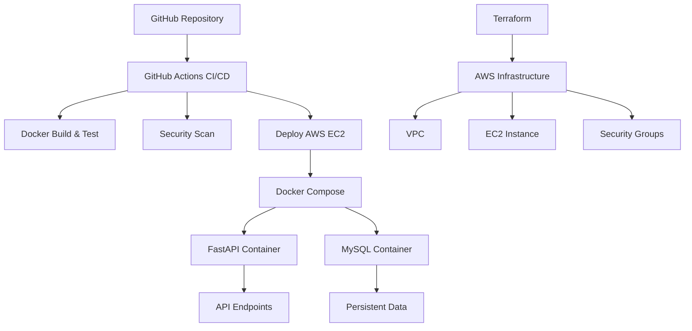

# EasyOrder API 🚀

> Sistema de gerenciamento de pedidos e clientes com pipeline DevOps completo

[](https://github.com/SEU_USUARIO/trabalhodevops/actions)
[](https://github.com/SEU_USUARIO/trabalhodevops/actions)
[](https://www.python.org/downloads/)
[](https://fastapi.tiangolo.com)
[](https://www.docker.com/)

## 📖 Índice

- [Sobre o Projeto](#sobre-o-projeto)
- [Arquitetura](#arquitetura)
- [Funcionalidades](#funcionalidades)
- [Tecnologias Utilizadas](#tecnologias-utilizadas)
- [Pré-requisitos](#pré-requisitos)
- [Instalação e Configuração](#instalação-e-configuração)
- [Como Usar](#como-usar)
- [API Endpoints](#api-endpoints)
- [Deploy na AWS](#deploy-na-aws)
- [Pipeline CI/CD](#pipeline-cicd)
- [Testes](#testes)
- [Monitoramento](#monitoramento)
- [Contribuição](#contribuição)
- [Troubleshooting](#troubleshooting)

## 🎯 Sobre o Projeto

O **EasyOrder** é uma API RESTful desenvolvida em Python com FastAPI para gerenciamento de pedidos, clientes, produtos, pagamentos e entregas. O projeto implementa práticas modernas de DevOps com pipeline completo de CI/CD, testes automatizados, segurança e deploy na AWS.

### 🎓 Contexto Acadêmico
- **Curso**: Análise e Desenvolvimento de Sistemas
- **Instituição**: Uninter
- **Disciplina**: DevOps
- **Objetivo**: Demonstrar conhecimentos em DevOps, containerização, CI/CD e cloud computing

## 🏗️ Arquitetura



## ✨ Funcionalidades

### 🔧 Core Features
- ✅ **CRUD Completo**: Clientes, Produtos, Pedidos, Pagamentos, Entregas
- ✅ **API RESTful**: Endpoints padronizados com documentação automática
- ✅ **Validação de Dados**: Schemas Pydantic para entrada e saída
- ✅ **Banco de Dados**: Suporte MySQL (produção) e SQLite (desenvolvimento)
- ✅ **Migrações**: Alembic para versionamento do schema
- ✅ **Relatórios**: Endpoints para análises de negócio

### 🚀 DevOps Features
- ✅ **Containerização**: Docker e Docker Compose
- ✅ **CI/CD Pipeline**: GitHub Actions com múltiplas etapas
- ✅ **Testes Automatizados**: Unit, Integration e Build tests
- ✅ **Security Scanning**: Trivy para vulnerabilidades
- ✅ **Code Quality**: Flake8, Black, MyPy
- ✅ **Infrastructure as Code**: Terraform para AWS
- ✅ **Monitoramento**: CloudWatch Logs integration

## 🛠️ Tecnologias Utilizadas

### Backend
- 
- 
- 
- 
- 

### Database
- 
- 

### DevOps & Infrastructure
- 
- 
- 
- 
- 

### Testing & Quality
- 
- 
- 

## 📋 Pré-requisitos

### Para Desenvolvimento Local
- Python 3.11+
- Docker & Docker Compose
- Git

### Para Deploy na AWS
- Conta AWS com credenciais configuradas
- Terraform instalado
- Chave SSH configurada

### Para CI/CD
- Repositório GitHub
- Secrets configurados no GitHub Actions

## 🚀 Instalação e Configuração

### 1. Clone do Repositório
```bash
git clone https://github.com/SEU_USUARIO/trabalhodevops.git
cd trabalhodevops
```

### 2. Configuração Local (Desenvolvimento)

#### Opção A: Python Virtual Environment
```bash
# Criar e ativar ambiente virtual
python -m venv venv
source venv/bin/activate  # Linux/Mac
# ou
venv\Scripts\activate  # Windows

# Instalar dependências
pip install -r requirements.txt

# Configurar banco de dados
mkdir -p data
alembic upgrade head

# Popular banco com dados de exemplo
python seed.py

# Executar aplicação
uvicorn app.main:app --reload
```

#### Opção B: Docker Compose (Recomendado)
```bash
# Copiar arquivo de ambiente
cp .env.example .env

# Subir aplicação com banco MySQL
docker-compose up --build

# A API estará disponível em http://localhost:8000
```

### 3. Verificação da Instalação
```bash
# Testar API
curl http://localhost:8000/

# Acessar documentação interativa
# http://localhost:8000/docs
```

## 🎮 Como Usar

### Documentação Interativa
Acesse `http://localhost:8000/docs` para ver a documentação automática do Swagger UI.

### Exemplos de Uso

#### Criar Cliente
```bash
curl -X POST "http://localhost:8000/clientes/" \
     -H "Content-Type: application/json" \
     -d '{
       "nome": "João Silva",
       "email": "joao@email.com"
     }'
```

#### Listar Produtos
```bash
curl "http://localhost:8000/produtos/"
```

#### Criar Pedido
```bash
curl -X POST "http://localhost:8000/pedidos/?cliente_id=1" \
     -H "Content-Type: application/json" \
     -d '{
       "descricao": "Pedido de notebook"
     }'
```

## 📡 API Endpoints

### Clientes
| Método | Endpoint | Descrição |
|--------|----------|-----------|
| GET | `/clientes/` | Lista clientes |
| POST | `/clientes/` | Cria cliente |
| GET | `/clientes/{id}` | Obtém cliente |

### Produtos
| Método | Endpoint | Descrição |
|--------|----------|-----------|
| GET | `/produtos/` | Lista produtos |
| POST | `/produtos/` | Cria produto |
| GET | `/produtos/{id}` | Obtém produto |
| PUT | `/produtos/{id}` | Atualiza produto |
| DELETE | `/produtos/{id}` | Remove produto |

### Pedidos
| Método | Endpoint | Descrição |
|--------|----------|-----------|
| GET | `/pedidos/` | Lista pedidos |
| POST | `/pedidos/?cliente_id={id}` | Cria pedido |
| GET | `/pedidos/{id}` | Obtém pedido |
| PUT | `/pedidos/{id}` | Atualiza pedido |
| DELETE | `/pedidos/{id}` | Remove pedido |

### Pagamentos
| Método | Endpoint | Descrição |
|--------|----------|-----------|
| GET | `/pagamentos/` | Lista pagamentos |
| POST | `/pagamentos/` | Cria pagamento |
| GET | `/pagamentos/{id}` | Obtém pagamento |
| PUT | `/pagamentos/{id}` | Atualiza pagamento |
| DELETE | `/pagamentos/{id}` | Remove pagamento |

### Entregas
| Método | Endpoint | Descrição |
|--------|----------|-----------|
| GET | `/entregas/` | Lista entregas |
| POST | `/entregas/criar` | Cria entrega |
| GET | `/entregas/{id}` | Obtém entrega |
| PUT | `/entregas/{id}` | Atualiza entrega |
| DELETE | `/entregas/{id}` | Remove entrega |

### Relatórios
| Método | Endpoint | Descrição |
|--------|----------|-----------|
| GET | `/relatorios/pedidos-por-cliente` | Pedidos por cliente |
| GET | `/relatorios/faturamento?inicio=YYYY-MM-DD&fim=YYYY-MM-DD` | Faturamento período |
| GET | `/relatorios/produtos-estoque-baixo?limite=5` | Produtos com estoque baixo |

## ☁️ Deploy na AWS

### 1. Preparação
```bash
# Gerar chave SSH
ssh-keygen -t rsa -b 4096 -f ~/.ssh/easyorder_key -N ""

# Navegar para diretório Terraform
cd infra/terraform
```

### 2. Configuração do Terraform
```bash
# Inicializar Terraform
terraform init

# Planejar mudanças
terraform plan

# Aplicar infraestrutura
terraform apply -auto-approve
```

### 3. Configuração dos Secrets do GitHub
No repositório GitHub, vá em **Settings → Secrets and variables → Actions**:

- `EC2_SSH_KEY`: Conteúdo de `~/.ssh/easyorder_key` (chave privada)
- `EC2_PUBLIC_IP`: IP público da instância (output do Terraform)

### 4. Deploy Automático
```bash
# Fazer push para main branch
git add .
git commit -m "Deploy para produção"
git push origin main

# O GitHub Actions executará o pipeline automaticamente
```

### 5. Verificação
```bash
# Conectar à instância
ssh -i ~/.ssh/easyorder_key ubuntu@SEU_IP_PUBLICO

# Verificar containers
docker-compose ps

# Testar API
curl http://SEU_IP_PUBLICO:8000/
```

## 🔄 Pipeline CI/CD

### Workflow de CI
1. **Lint e Qualidade**: Flake8, Black, isort, MyPy
2. **Testes**: Pytest com coverage
3. **Build**: Docker image build e testes
4. **Security**: Trivy vulnerability scan

### Workflow de CD
1. **Deploy**: SSH para EC2 e atualização dos containers
2. **Health Check**: Verificação se API está respondendo
3. **Rollback**: Em caso de falha (futuro)

### Estrutura dos Workflows
```
.github/workflows/
├── ci.yml          # Continuous Integration
└── cd.yml          # Continuous Deployment
```

## 🧪 Testes

### Executar Todos os Testes
```bash
# Com pytest
python -m pytest -v

# Com coverage
python -m pytest --cov=app --cov-report=html

# Testes específicos
python -m pytest tests/test_clientes.py -v
```

### Tipos de Testes
- **Unit Tests**: Testes de funcionalidades individuais
- **Integration Tests**: Testes de integração entre componentes
- **Build Tests**: Validação de builds Docker
- **API Tests**: Testes end-to-end da API

### Estrutura de Testes
```
tests/
├── conftest.py                # Configurações globais
├── test_clientes.py          # Testes de clientes
├── test_produtos.py          # Testes de produtos
├── test_pedidos.py           # Testes de pedidos
├── test_docker_build.py      # Testes de build Docker
└── test_integration.py       # Testes de integração
```

## 📊 Monitoramento

### Logs
- **Local**: Logs aparecem no console
- **AWS**: CloudWatch Logs (configurado via watchtower)
- **Docker**: `docker-compose logs api`

### Health Checks
- **Endpoint**: `GET /` retorna status da aplicação
- **Database**: Verificação automática de conectividade
- **Container**: Health checks do Docker Compose

### Métricas (Futuro)
- Response time por endpoint
- Rate limiting
- Error rates
- Database performance

## 🤝 Contribuição

### Como Contribuir
1. Fork do projeto
2. Crie uma branch para sua feature (`git checkout -b feature/nova-feature`)
3. Commit suas mudanças (`git commit -m 'Adiciona nova feature'`)
4. Push para a branch (`git push origin feature/nova-feature`)
5. Abra um Pull Request

### Padrões de Código
- Use **Black** para formatação
- Siga **PEP 8** para style guide
- Adicione **docstrings** em funções
- Escreva **testes** para novas funcionalidades
- Mantenha **coverage** acima de 80%

### Estrutura do Projeto
```
trabalhodevops/
├── app/                      # Código da aplicação
│   ├── routers/             # Endpoints da API
│   ├── models.py            # Modelos SQLAlchemy
│   ├── schemas.py           # Schemas Pydantic
│   ├── crud.py              # Operações CRUD
│   ├── database.py          # Configuração do banco
│   └── main.py              # Aplicação principal
├── tests/                   # Testes automatizados
├── alembic/                 # Migrações do banco
├── infra/                   # Infraestrutura como código
│   └── terraform/           # Configurações Terraform
├── .github/workflows/       # GitHub Actions
├── docker-compose.yml       # Orquestração containers
├── Dockerfile              # Imagem da aplicação
├── requirements.txt        # Dependências Python
└── README.md              # Este arquivo
```

## 🔧 Troubleshooting

### Problemas Comuns

#### 1. Container não inicia
```bash
# Verificar logs
docker-compose logs api

# Problema comum: banco não está pronto
# Solução: aguardar health check do MySQL
```

#### 2. Erro de conexão com banco
```bash
# Verificar variáveis de ambiente
docker-compose exec api env | grep DATABASE

# Verificar se banco está rodando
docker-compose exec db mysql -u root -p -e "SHOW DATABASES;"
```

#### 3. GitHub Actions falha no deploy
```bash
# Verificar secrets
# EC2_SSH_KEY deve ser a chave privada completa
# EC2_PUBLIC_IP deve estar atualizado

# Verificar se instância está acessível
ssh -i ~/.ssh/easyorder_key ubuntu@SEU_IP_PUBLICO
```

#### 4. Terraform apply falha
```bash
# Verificar credenciais AWS
aws configure list

# Verificar se chave SSH existe
ls -la ~/.ssh/easyorder_key*

# Verificar syntax
terraform validate
```

### Logs Úteis
```bash
# Logs da aplicação
docker-compose logs -f api

# Logs do banco
docker-compose logs -f db

# Logs do GitHub Actions
# Disponível na aba Actions do repositório

# Logs da instância EC2
ssh -i ~/.ssh/easyorder_key ubuntu@IP_PUBLICO
sudo journalctl -u docker -f
```

### Performance
```bash
# Monitorar recursos
docker stats

# Verificar conexões de rede
docker-compose exec api netstat -an

# Verificar espaço em disco
df -h
```

## 📈 Roadmap

### Próximas Features
- [ ] Autenticação JWT
- [ ] Rate limiting
- [ ] Cache com Redis
- [ ] Notificações por email
- [ ] Dashboard web
- [ ] API versioning
- [ ] Testes de carga automatizados
- [ ] Blue-green deployment

### Melhorias de Infraestrutura
- [ ] Load balancer (ALB)
- [ ] RDS para banco de dados
- [ ] ECS/EKS para containers
- [ ] CloudFormation templates
- [ ] Monitoring com Prometheus
- [ ] Alertas automáticos

## 📄 Licença

Este projeto foi desenvolvido para fins acadêmicos como parte do curso de Análise e Desenvolvimento de Sistemas da Uninter.

## Integrantes do Grupo

- **Weden Gabriel da Silva Gomes**  
  - RU: 4170826
  - GitHub: [wedengabriel](https://github.com/wedengabriel)

- **Desyree N Garcia Batista**  
  - RU: 986134
  - GitHub: [desyreegarcia](https://github.com/desyreegarcia)

- **Cleberton Gonçalves da Silva**  
  - RU: 4710627  
  - GitHub: ([Meowkay92](https://github.com/Meowkay92)

- **Lucas Silva**  
  - RU: 4702132  
  - GitHub: [onlyluc](https://github.com/onlyluc)

- **Arissa Andreina Kohata**  
  - RU: 4711950  
  - GitHub: [arissak](https://github.com/arissak)

- **Edi Carlos Celestino Silva**  
  - RU: 4661343  
  - GitHub: [ediicarllos](https://github.com/ediicarllos)

- **Eliseu de Lima Andrade**  
  - RU: 4709242  
  - GitHub: [eliseulima5](https://github.com/eliseulima5) 

- **Jamile Santana da Silva**  
  - RU: 4773362  
  - GitHub: [Jhamyllie](https://github.com/Jhamyllie)
 
- **Lucas Silva**  
  - RU: 4693460  
  - GitHub: [luc4s-jpg](https://github.com/luc4s-jpg)

   **Gabriel Correa da Silva**  
  - RU: 4709634  
  - GitHub: [GabrielCorrea197](https://github.com/GabrielCorrea197)

  **Diemeson Conceição**  
  - RU: 4836302
 
  ### Prints


## 🙏 Agradecimentos

- **Uninter** pela oportunidade de aprendizado
- **Professor(a)** pela orientação na disciplina
- **Comunidade Open Source** pelas ferramentas incríveis
- **AWS** pelos créditos educacionais

---

<div align="center">

**⭐ Se este projeto foi útil para você, considere dar uma estrela!**

Made with ❤️ for DevOps learning

</div>
